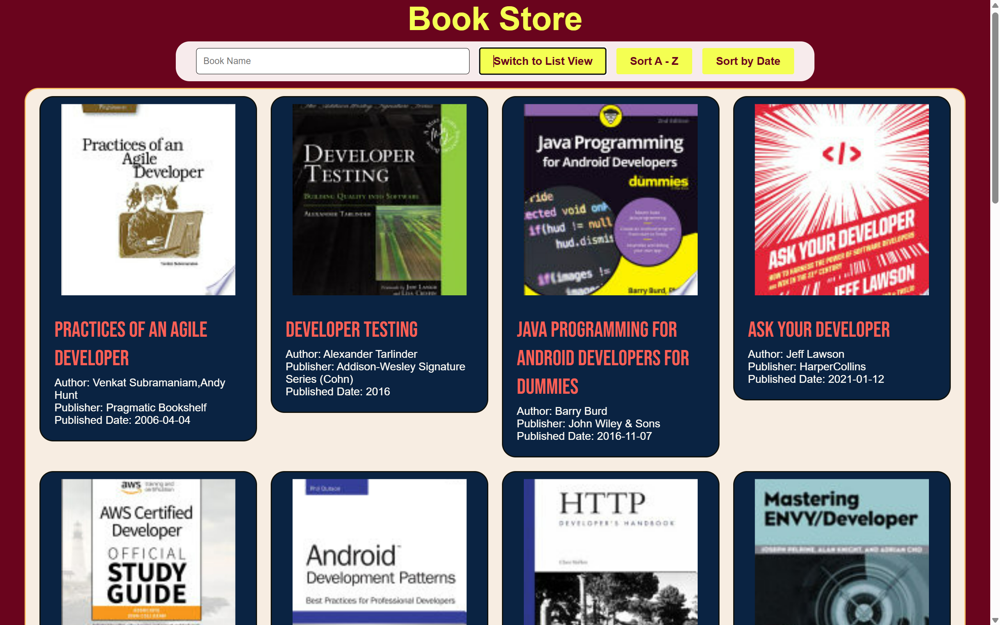

# Masterji Assignment 4 - Book Store

A dynamic book library website using FreeAPI.app that fetches and displays book data in a user-friendly way. This project demonstrates working with API requests, handling JSON data, and rendering dynamic content using JavaScript.



## Tech Stack

- HTML5
- CSS3
- JavaScript (ES6+)
- Package: Axios
- API: [FreeAPI Books](https://api.freeapi.app/api/v1/public/books)

## Features

### 1. Book Display and Styling
- Implemented responsive grid and list views using CSS Grid
- Styled book cards with cover images and details
```css
.booksstore {
    display: grid;
    grid-template-columns: repeat(4, 1fr);
    gap: 20px;
    padding: 10px 20px;
}
```

### 2. Dynamic Loading and Pagination
- Fetched books using Axios with pagination support
- Implemented navigation buttons for page traversal
```javascript
async function getBooks(pageno) {
    const options = {
        method: "GET",
        url: "https://api.freeapi.app/api/v1/public/books",
        params: { page: pageno, limit: "20" }
    };
    const { data } = await axios.request(options);
    return data;
}
```

### 3. Search Functionality
- Real-time search filtering by title/author
```javascript
function filterBooks() {
    const bookname = document.getElementById("booknameinput").value;
    const filteredBooks = allBooks.filter((book) =>
        book.volumeInfo.title.toLowerCase().includes(bookname.toLowerCase())
    );
    displayBooks(filteredBooks);
}
```

### 4. Sorting Features
- Sort books by title (A-Z)
- Sort by publication date
```javascript
function sortbydate() {
    const sortedBooks = allBooks.sort((a, b) =>
        new Date(a.volumeInfo.publishedDate) - new Date(b.volumeInfo.publishedDate)
    );
    displayBooks(sortedBooks);
}
```

### 5. View Toggle
- Switch between grid and list layouts
- Persists view preference using localStorage
```javascript
function toogleview() {
    const bookcontainer = document.querySelector(".booksstore");
    bookcontainer.classList.toggle("list-view");
    localStorage.setItem("preferredView", 
        bookcontainer.classList.contains("list-view") ? "list" : "grid"
    );
}
```

### 6. Responsive Design
- Mobile-first approach with media queries
- Adaptive layouts for different screen sizes
```css
@media screen and (max-width: 768px) {
    .booksstore {
        grid-template-columns: repeat(auto-fit, minmax(200px, 1fr));
    }
}
```

## Setup Instructions

1. Clone the repository
```bash
git clone <repository-url>
```

2. Open index.html in your browser or use a live server

## Project Structure

```
Assignment 4/
├── index.html
├── style.css
├── script.js
└── README.md
```

## Live Demo
[View Live Project](#) (https://bucolic-dodol-8a4ac5.netlify.app/)


## Author
Kartikey Katyal